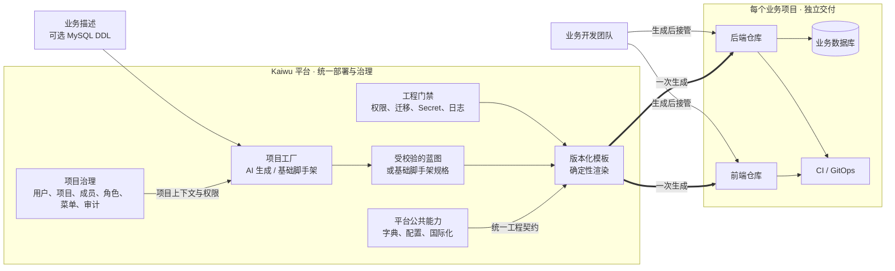
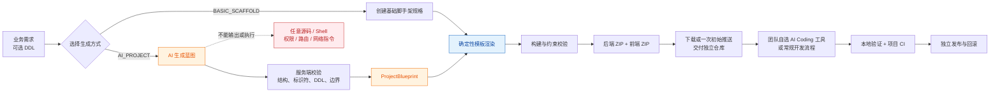
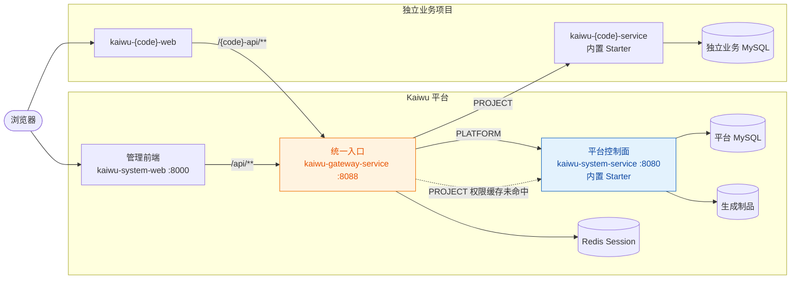
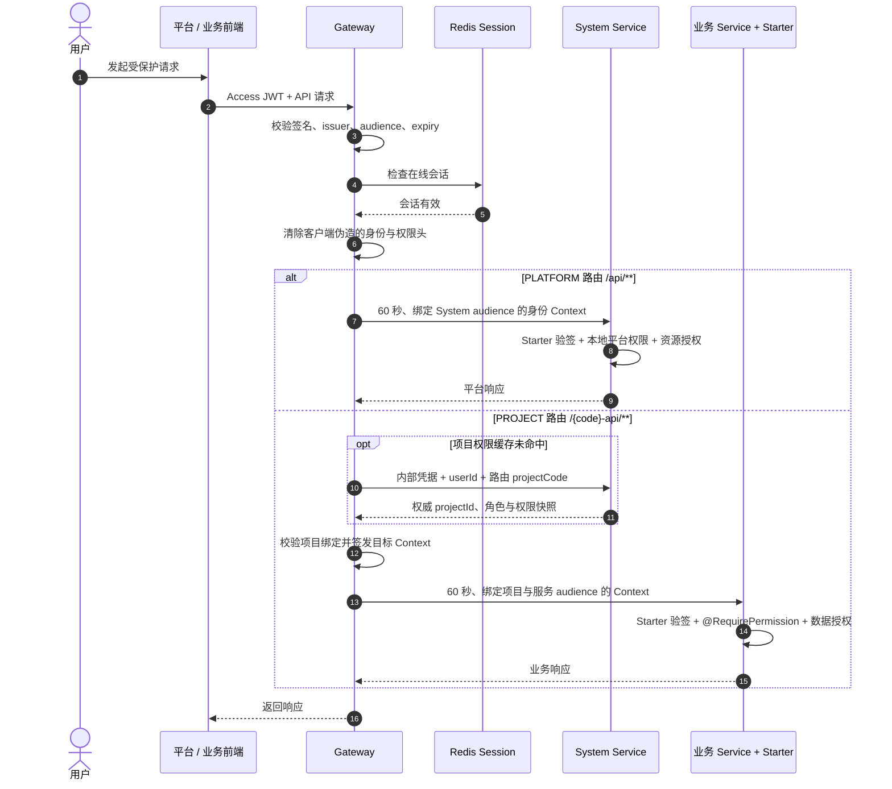
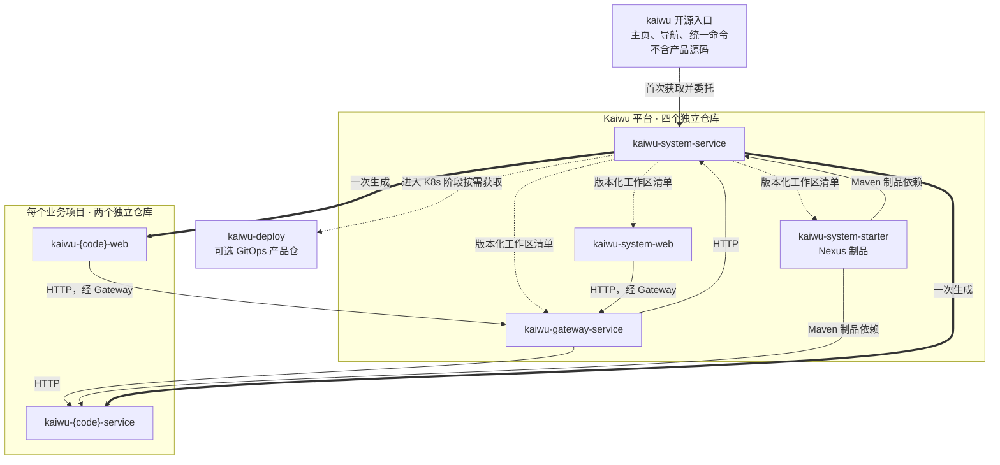
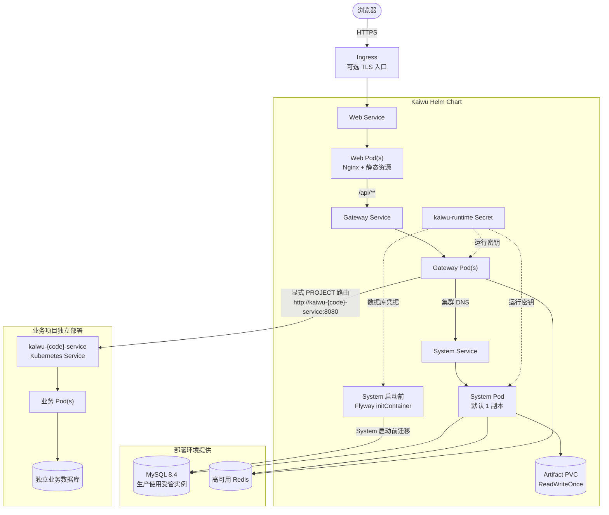
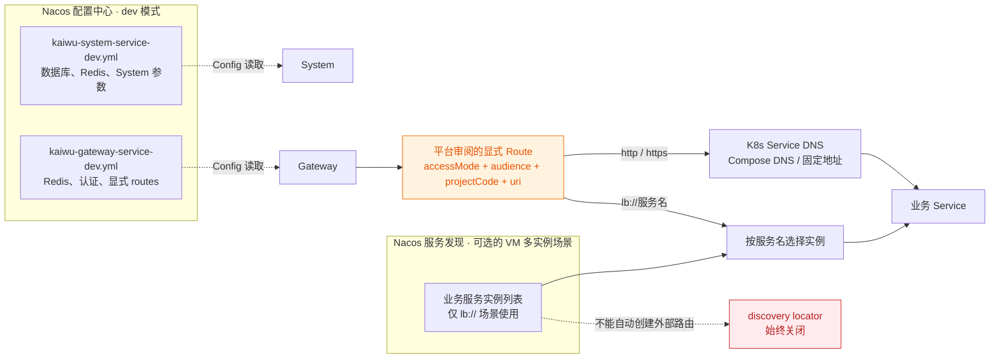

# Kaiwu 架构图谱：从业务描述到独立项目

> **Kaiwu 用统一治理和确定性工程，创建可独立交付、可由团队长期接管的业务项目。**
> AI 可以辅助形成第一版业务蓝图，也可以完全不参与；生成完成后，团队使用熟悉的 AI Coding 工具
> 或常规开发流程继续演进。

本文用 7 张图说明 Kaiwu 是什么、为什么这样设计，以及项目如何生成、运行、鉴权和部署。完整约束以
[`ARCHITECTURE.md`](ARCHITECTURE.md)、[`REQUIREMENTS.md`](REQUIREMENTS.md) 和 [`adr/`](adr/) 为准。

> 希望用更直观的方式阅读？打开[可交互 HTML 版本](ARCHITECTURE-GUIDE.html)。Markdown 继续作为
> 可评审、可版本化的图文事实源，HTML 用于更适合浏览器的视觉表达。

## 先看结论

> **平台克制，项目自治；AI 辅助理解，模板确定交付；生成只负责起点，代码长期属于团队。**

| Kaiwu 负责什么 | 最终交付什么 |
|---|---|
| 统一治理用户、组织、项目、成员、角色、菜单、字典、配置和审计等平台事实 | 每个项目从创建开始就有明确的归属、成员和权限上下文 |
| 根据业务描述和可选 DDL 创建第一版；AI 蓝图与基础脚手架两种方式都可用 | 结构一致、能够验证的前后端工程，不依赖模型才能创建 |
| 通过 Gateway、System 和 Starter 建立统一入口与分层授权 | 平台事实保持统一，业务代码和业务数据仍归各项目所有 |
| 完成 ZIP 交付或向空仓库执行一次初始推送，随后退出写入 | 独立前端仓库、后端仓库、业务数据库、CI 和 GitOps 路径 |

Kaiwu 不是把业务持续托管在平台中的低代码运行时，也不是让模型任意写文件和执行命令的 Agent 平台。
它解决的是：**怎样先建立可靠的治理和工程起点，再把一个真正可接管的项目交给业务团队。**

## 图 1：从平台治理到独立业务项目

图的左侧是 Kaiwu 的长期职责：治理平台事实、约束生成过程、提供统一入口。右侧是业务团队的长期职责：
维护自己的代码、数据和发布节奏。

这里最重要的边界是：**Kaiwu 生成项目，但不托管项目后续代码演进。** 一个项目成功生成后不能再次
生成；平台只允许向两个已验证为空的 GitLab 仓库分别做一次初始推送，之后永久退出写入权。

## Kaiwu 的工程哲学：为什么选择这条路

AI Coding 已经能很快写出页面和接口。真正决定代码能否长期接管的，不是生成速度，而是 AI 能否快速获得
有效上下文、修改时能否遵守跨层契约、异常和越权路径有没有被验证，以及第一版能否直接进入持续交付。
Kaiwu 不替代团队选择的 AI Coding 工具，而是先把这些工程前提放进项目里。

### Kaiwu 的回答

| 工程哲学 | 如何落实 | 形成的优势 |
|---|---|---|
| **平台克制，业务按需生长** | 平台聚焦通用治理、统一入口和项目工厂，不把工作流、消息队列、分布式事务、报表中心或 AI 应用平台预装进每个业务项目 | 平台边界更容易理解；业务项目只引入真正需要的能力，团队面对更聚焦的代码和依赖范围 |
| **治理统一，业务物理独立** | System 维护平台事实；每个项目拥有独立前端仓库、后端仓库、数据库、部署单元、CI 和 GitOps 路径 | 不重复建设身份和项目治理，同时保留项目独立版本、发布、扩容和回滚的能力 |
| **代码优先，仓库是业务实现的事实源** | 生成标准 Java、TypeScript 和 SQL 工程，不用在线表单、流程或报表元数据承载业务逻辑 | 业务实现、评审和版本历史集中在普通仓库，可以被常规开发流程和不同 AI Coding 工具持续维护 |
| **AI 处理不确定性，模板守住确定性** | AI 可选地生成受校验的 `ProjectBlueprint`；源码、SQL、权限、路由和 CI 由版本化模板渲染 | 使用 AI 理解业务，但不让模型决定工程结构、安全边界和交付质量；不使用 AI 也能创建同一工程基线 |
| **显示可以变化，协议必须稳定** | 中文、英文、动态菜单、字典和跨服务错误走统一语言目录；翻译不改变权限码、状态码、ID、字典值和 Context | 多语言不会制造第二套权限或接口事实，新语言未通过完整覆盖门禁时不会暴露半翻译界面 |
| **规范必须可以执行** | 将权限三端同码、数据归属、Flyway、查询边界、敏感日志、线程和供应链等规则放入本地检查和 CI | 规范不只依赖人或 AI 记住，可判断的问题在提交和构建阶段尽早反馈 |
| **生成是交付，不是控制** | 一个项目只生成一次，只向空仓库做一次初始推送，成功后平台永久退出业务仓库写入 | 生成器不会覆盖人工或 AI 的后续修改，代码所有权、工具选择和发布节奏长期属于业务团队 |

这套哲学带来的核心优势可以归纳为三个结果：**边界清晰、代码可接管、工程可验证。** 代价也很明确：
Kaiwu 不提供在线表单、工作流和报表设计器，也不把模板升级自动回写到已经交付的项目。需要大量现成业务
模块或零代码配置标准流程时，功能完整型平台会更合适。

## 图 2：AI 可选的项目生成流水线

AI 不是生成项目的前置条件。选择 `AI_PROJECT` 时，AI 可以参与第一版业务建模，生成数据模型、模块说明
和字段展示元数据；选择 `BASIC_SCAFFOLD` 时，不调用模型，直接生成可启动的空项目。两种方式最终都进入
同一套确定性模板和质量校验，因此工程结构、权限契约和交付方式保持一致。

无论是否使用 AI，模型都不直接写入任意源码或控制执行环境。生成完成后，平台不再持续修改业务仓库；
开发团队可以使用自己熟悉的 AI Coding 工具，也可以按常规开发流程继续迭代。
生成仓库中的 `AGENTS.md`、`CLAUDE.md` 和工程约束会为后续工具提供项目上下文。

同一项目只有一条生成记录：失败时在原记录上重试，`SUCCESS` 后永久锁定。生成详情见
[`PROJECT_FACTORY.md`](PROJECT_FACTORY.md)。

生成的不只是 CRUD 页面。两个仓库同时获得构建命令、权限与字典检查、敏感日志检查、查询边界、
供应链扫描和协作说明。业务团队接管后，仍然在同一套质量基线上继续开发。

## 为什么更适合后续 AI Coding

AI Coding 不缺写代码的速度，缺的是一条稳定的工程闭环：先读到真正相关的上下文，再沿明确契约完成修改，
最后由可执行门禁验证完整性、安全边界和交付条件。Kaiwu 不假设 AI 能一次读懂任意规模的代码库，也不假设
一段能运行的代码已经可以交付。

| 当前 AI 编程的痛点 | Kaiwu 已经提供的机制 | 带来的结果 |
|---|---|---|
| **代码看了一大圈，关键关系仍没进上下文** | 业务代码留在独立项目仓库，平台能力通过 Gateway Context 和 Starter 等稳定契约接入；仓库地图进一步标明主要入口 | 检索范围从整个平台收敛到当前业务，有限上下文优先用于真正相关的代码和依赖 |
| **每次换人或换工具，都要重新解释项目规矩** | `AGENTS.md`、`CLAUDE.md`、README、构建命令、启动脚本和工程约束随仓库版本化 | 新成员和新的 AI 工具从同一入口开始，不依赖某次聊天记录或个人全局配置还原基础规则 |
| **页面改完了，接口、权限、菜单或 SQL 漏了一处** | 权限、字典、迁移、查询和日志等跨层契约进入确定性模板、本地检查和 CI | 不一致在提交或构建阶段直接暴露，人工评审可以集中判断业务，而不是逐项查漏 |
| **正常流程能跑，异常和越权路径没有答案** | Gateway、System、Starter 与业务服务分层授权，业务资源明确数据归属，并用反向用例验证失败关闭 | 第一版不只证明“谁能访问”，也明确“谁必须被拒绝”，身份或权限事实不完整时不会放行 |
| **演示代码已经完成，真正上线还要重做一遍** | Flyway 迁移、Dockerfile、验证 CI、Secret 约束、构建命令和发布接入文件随工程生成 | 第一版可以直接进入持续构建、测试和发布准备，不需要先把一次性演示改造成工程 |

这里的“上下文”只指 Kaiwu 已经写入仓库的工程结构、命令和规则。Kaiwu 当前不会读取或沉淀 AI 聊天
记录，也不会自动把需求讨论和领域决策写入仓库；这些内容仍需要团队通过项目文档或 ADR 维护，AI 的输出
也仍然需要代码评审。

## 图 3：平台与业务项目的运行时关系

这张图体现了 Kaiwu 的三个运行时原则：

1. **所有外部 API 都经过 Gateway。** 服务注册不等于对外发布，只有显式登记的路由可以进入。
2. **平台事实与业务数据分离。** System 只访问平台库；每个业务服务只访问自己的业务库。
3. **Starter 是 SDK，不是运行进程。** System 和业务服务都在本地完成 Context 验签与接口权限校验。

AI Provider、GitLab 和 Nacos 是按能力或部署形态启用的外部依赖，不改变核心请求拓扑。生成项目上线前
还需登记服务地址和 Gateway 显式路由，操作步骤见 [`PROJECT_ACCESS.md`](PROJECT_ACCESS.md)。

## 图 4：PLATFORM 与 PROJECT 请求的授权链路

授权职责不是集中在某一个组件，而是有清晰分层：

- Gateway 回答“身份是否可信、会话是否在线、是否允许进入这个项目服务”。
- System 是用户、项目成员、角色、菜单和权限的唯一事实源。
- 目标服务回答“是否拥有接口权限，以及当前数据归属和资源状态是否允许操作”。

外部 JWT 只由 Gateway 接受；目标服务只接受 Gateway 签发、绑定目标 audience 的短期 Context。
无法确定身份、会话或权限时一律失败关闭。完整信任边界见
[`ADR 0003`](adr/0003-gateway-centric-authentication.md) 和
[`ADR 0022`](adr/0022-project-entry-authorization-and-addressing.md)。

## 图 5：仓库边界与长期所有权

`kaiwu` 只是开源发现和命令入口；平台四个运行仓与可选 Deploy 仓仍是独立产品仓，每个业务项目
也固定交付两个独立仓。公开 Release 使用同名 tag 形成兼容单元，但不把源码合并到入口。普通用户
不需要 submodule，产品仓之间也不通过相对路径共享源码；跨仓复用只通过稳定 HTTP 契约或已发布制品。

这种边界带来的直接结果是：平台可以持续演进，业务项目可以按自己的节奏升级 Starter、修改业务代码、
扩容和回滚，两者不会因为共享代码仓库或共享数据库而绑定发布。

## 运行与部署方式一览

| 使用场景 | 入口 | 应用与基础设施 | 配置来源 | Nacos |
|---|---|---|---|---|
| 首次体验、演示、验证发布物 | 在入口仓执行 `./kaiwu up` | 全部由 Docker Compose 管理 | `.kaiwu/dev.env` + `local` profile | 不需要 |
| 日常前后端开发 | 在入口仓执行 `./kaiwu dev` | MySQL/Redis 在 Docker；三个应用为本机进程 | `.kaiwu/dev.env` + `local` profile | 不需要 |
| 验证 Nacos 配置的容器环境 | `./scripts/dev-nacos-run.sh` | 全部由 Docker Compose 管理 | Nacos `dev` Data ID | 只读取配置，服务发现关闭 |
| 接入已有开发基础设施 | `./scripts/kaiwu.sh local-up` | 三个应用为本机进程；MySQL/Redis 由环境提供 | Nacos `dev` Data ID | 只读取配置，服务发现关闭 |
| Kubernetes 部署 | Helm Chart | System/Gateway/Web 为 Pod；生产使用受管 MySQL/Redis | Secret + values + 集群 DNS | 默认不需要 |

这些方式只改变进程在哪里运行、配置从哪里取得、服务如何寻址，不改变
“Web → Gateway → System / 业务 Service”的核心架构。日常开发优先使用 `dev`。

## 图 6：Kubernetes 部署拓扑

Helm Chart 只管理 Kaiwu 平台的 System、Gateway、Web、Flyway 和制品 PVC；每个业务项目继续拥有
自己的 Deployment、Service、数据库和发布周期。生产环境的 MySQL、Redis、TLS、备份和 Secret
管理由部署平台提供，Chart 内置的单实例 MySQL/Redis 只用于开发或演示集群。

Kubernetes 中使用 Service DNS 完成服务寻址，因此 **Nacos 不是启动前提**。Web 和 Gateway 无状态，
可以增加副本；System 当前使用 ReadWriteOnce 制品 PVC，默认保持一个副本并使用 `Recreate` 更新。
Flyway initContainer 迁移失败时 System 不会启动。完整部署、升级与回滚见
[`KUBERNETES.md`](KUBERNETES.md)。

## 图 7：Nacos 的配置与服务发现边界

Nacos 在 Kaiwu 中有两个彼此独立的用途：

1. **配置中心**：`dev-nacos-run.sh` 与 `local-up` 从两个受保护 Data ID 读取 System/Gateway 配置；
   这两种模式都关闭平台服务的 Nacos 注册与发现。
2. **可选服务发现**：只有 VM 多实例、没有 Kubernetes/Compose DNS 等稳定寻址能力时，业务项目才需要
   自行注册，Gateway 的显式路由才使用 `lb://服务名` 选择实例。

无论是否使用 Nacos，Gateway 都禁止 discovery locator。服务出现在注册中心只说明“实例在哪里”，
不代表“允许从外部访问”；对外发布仍必须由平台生成并审阅包含 `accessMode`、`audience`、
`projectCode` 的显式路由。配置、Secret 和启动细节见 [`NACOS.md`](NACOS.md)。

## 适用边界

Kaiwu 适合希望统一后台项目治理、快速生成第一版工程，并要求业务项目保持独立交付的团队。
如果目标是让模型持续向已有仓库任意写代码、在同一个运行时动态拼装业务模块，或让每个项目自由选择
完全不同的技术栈，则不属于当前阶段的设计范围。

当前固定技术基线为 Spring Boot 4、JDK 21、`@umijs/max`、Ant Design 5 和 ProComponents。
这项约束换来的是模板可验证、工程规则可执行，以及生成项目的一致可维护性。

当前还需要注意三个边界：

- 一个项目成功生成后不会被平台再次生成或自动升级模板，后续演进由业务团队负责。
- 平台会生成完整 Gateway 路由片段，但写入受管路由配置目前仍是人工步骤。
- Kubernetes 中的 System 当前使用 ReadWriteOnce 制品卷，默认保持单副本；Web 和 Gateway 可以独立扩容。

## 图的维护方式

- Mermaid 源码随 Markdown 版本化，GitHub/GitLab 可直接渲染，评审能够看到语义差异。
- `ARCHITECTURE.md` 和 ADR 是架构事实源；本页只负责快速理解，边界变化时先更新 ADR。
- 图中只保留组件、责任和关键关系，异常语义、配置项和实现细节放在正文或专项文档。
- 需要用于汇报时从同一份 Mermaid 导出 SVG/PNG，不在其它绘图工具中维护第二份架构事实。

## 继续阅读

- [`OVERVIEW.md`](OVERVIEW.md)：10 分钟产品与使用概览
- [`QUICKSTART.md`](QUICKSTART.md)：启动平台、生成并运行第一个业务项目
- [`SERVER-DEPLOYMENT.md`](SERVER-DEPLOYMENT.md)：传统服务器部署
- [`KUBERNETES.md`](KUBERNETES.md)：Kubernetes 部署
- [`ARCHITECTURE.md`](ARCHITECTURE.md)：完整架构设计
- [`PROJECT_FACTORY.md`](PROJECT_FACTORY.md)：AI 项目工厂
- [`PROJECT_ACCESS.md`](PROJECT_ACCESS.md)：生成项目对外访问
