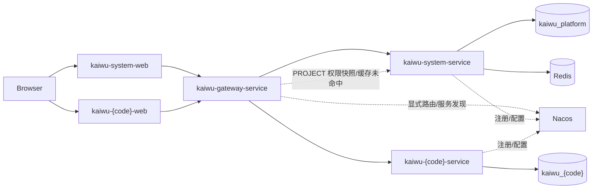
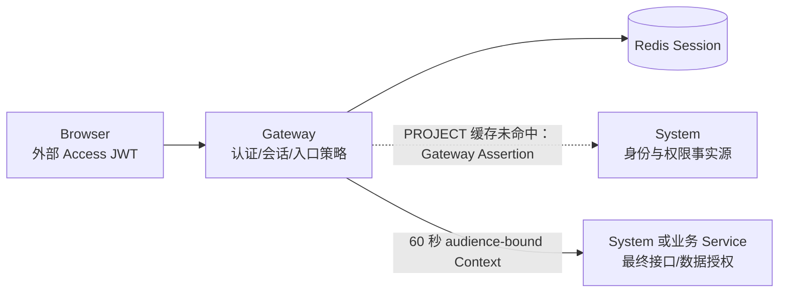

# Kaiwu 架构设计

> 文档版本：0.2
> 状态：Accepted，作为第一阶段实现基线
> 依据：Kaiwu 架构约束与多仓平台实践

第一次接触项目时，建议先看[架构图谱](ARCHITECTURE-GUIDE.md)，用 7 张图了解 Kaiwu 的价值、
项目生成主线、运行时全景、请求鉴权链路、仓库关系和部署方式，再回到本文查完整约束。

## 1. 决策摘要

Kaiwu 采用“薄入口分发、多仓自治、平台控制面、业务项目独立生成”的结构：

1. 开源用户只需克隆无产品源码的 `kaiwu` 入口；入口在被忽略的 `workspace/` 中准备运行仓。
2. Gateway、System 后端、System 前端、System Starter 与可选 Deploy 各自是独立产品仓库。
3. `kaiwu-system-service` 采用 Maven `api/domain/boot` 三模块结构。
4. 每个业务项目生成两个独立仓库，不把前端目录塞进后端仓库。
5. 平台数据库与每个业务数据库物理分离。
6. Gateway 从第一天存在，统一执行外部认证、在线会话检查、显式路由和项目入口策略；不拥有权限事实或业务规则。
7. System 签发仅供 Gateway 使用的外部 JWT；Gateway 签发 audience-bound 短期内部 Context；Starter 本地验签并执行最终权限。
8. 正常业务请求不由 Starter 同步回调 System。完整信任边界见 ADR 0003。

## 2. 工作区与仓库布局

目标物理结构：

```text
<checkout>/
└── kaiwu/                                 # 薄开源入口仓；不含产品源码
    ├── README.md                          # 项目主页与路线导航
    ├── kaiwu                              # 统一命令入口
    └── workspace/                         # 被入口忽略，可随时重建
        ├── kaiwu-gateway-service/         # 独立产品仓
        ├── kaiwu-system-service/          # 独立产品仓；启动契约事实源
        ├── kaiwu-system-web/              # 独立产品仓
        ├── kaiwu-system-starter/          # 独立产品仓
        └── kaiwu-deploy/                  # 可选独立产品仓；进入 GitOps 阶段才获取
```

入口只负责项目发现、仓库导航和命令委托；不复制 Compose、Helm、migration、模板或环境配置。
跨仓架构、需求、ADR 与启动契约仍由 `kaiwu-system-service` 保存。完整决策见
ADR 0027。

禁止：

- 把入口变成包含产品源码的 monorepo。
- 把 Git submodule 作为普通用户安装和启动的必经路径。
- 一个提交同时包含多个仓库代码。
- 通过相对源码路径依赖另一个仓库。

## 3. 平台仓库职责

| 仓库 | 输入 | 输出 | 数据 |
|---|---|---|---|
| `kaiwu-gateway-service` | 外部 HTTP、Nacos 显式路由、System PROJECT 权限快照 | 统一认证、会话检查、项目入口授权、短期 Context、traceId | Redis 只读在线会话；权限快照使用本地有界缓存；无业务表 |
| `kaiwu-system-service` | 平台管理请求、项目生成请求 | 平台 API、两个独立仓库 ZIP、一次性 GitLab 初始提交 | 只访问平台库和 Redis |
| `kaiwu-system-web` | 浏览器交互 | 平台管理 UI | 无数据库 |
| `kaiwu-system-starter` | Gateway Context、目标 audience、permission code | StarterContext、权限注解结果 | 无数据库 |

依赖方向：

```text
kaiwu-system-web --HTTP--> kaiwu-gateway-service --HTTP--> kaiwu-system-service
业务 Web          --HTTP--> kaiwu-gateway-service --HTTP--> 业务 Service
业务 Service      --Maven--> kaiwu-system-starter
kaiwu-system-service --Maven--> kaiwu-system-starter
kaiwu-gateway-service --HTTP/internal--> kaiwu-system-service（PROJECT 权限快照，缓存未命中）
```

Gateway 不依赖 System 的 domain jar；业务服务也不依赖 System domain。Starter 自包含身份与权限
Context 契约，不依赖 `kaiwu-system-api`，避免 System 与 Starter 形成发布顺序循环。

## 4. System 后端三模块

`kaiwu-system-service` 使用清晰的分层结构：

```text
kaiwu-system-service/
├── pom.xml                         # parent/BOM/模块聚合
├── kaiwu-system-api/
│   └── src/main/java/com/kaiwu/
│       ├── common/                 # Result、PageResult、ResultCode
│       └── module/*/dto|vo/        # 跨层数据契约
├── kaiwu-system-domain/
│   ├── src/main/java/com/kaiwu/
│   │   ├── config/                 # Java 配置
│   │   └── module/
│   │       ├── auth/
│   │       ├── user/
│   │       ├── role/
│   │       ├── menu/
│   │       ├── dict/
│   │       ├── config/
│   │       ├── audit/
│   │       ├── org/
│   │       ├── project/
│   │       ├── projectmember/
│   │       ├── projectrole/
│   │       ├── projectmenu/
│   │       ├── codegen/
│   │       ├── ai/                      # 受管 Provider 与字段元数据增强
│   │       ├── gitlab/
│   │       ├── projectgeneration/       # AI 蓝图、双仓脚手架与一次性交付
│   │       └── task/
│   └── src/main/resources/
│       └── templates/              # 后端/前端/CI/AGENTS 模板
├── kaiwu-system-boot/
│   ├── src/main/java/com/kaiwu/KaiwuApplication.java
│   └── src/main/resources/application.yml
├── sql/
│   ├── schema.sql
│   └── increment/V{n}__xxx.sql
├── scripts/
├── docs/
│   ├── ARCHITECTURE.md
│   ├── REQUIREMENTS.md
│   └── adr/
└── docker-compose.yml
```

分层规则：

### 4.1 API

- 只放 DTO、VO、统一返回结构、校验注解和稳定接口契约。
- 不放 Controller、Service、Entity、Mapper 或运行配置。
- 可单独发布到内部 Nexus，供确有需要的稳定 System HTTP 契约消费者使用；Starter 不依赖它。

### 4.2 Domain

- 放 Controller、Service、Entity、Mapper 和确定性生成控制面。
- 按业务模块纵向组织，每个模块内部保持 controller/service/entity/mapper。
- 跨业务模块的应用服务不得依赖对方的 Service、Repository、客户端或缓存键；统一依赖
  `com.kaiwu.port` 中按能力收窄的 Port，由模块边缘 Adapter 接入具体实现。请求 IP、Trace ID
  等无业务归属的值对象放在 `com.kaiwu.common`，禁止借用 audit 包充当公共层。
- 依赖 API，不被 Gateway 或业务项目直接依赖。
- 第一阶段只创建需求文档列出的模块。

### 4.3 Boot

- 只放启动类、应用配置、Nacos、数据库驱动、Actuator 和可执行包配置。
- 依赖 Domain。
- 禁止在 Boot 写业务 Controller 或 Service。

依赖只能是：

```text
boot -> domain -> api
```

## 5. 其它三个平台仓库

### 5.1 Gateway

保持单模块 Spring Boot 服务：

```text
kaiwu-gateway-service/
├── pom.xml
├── src/main/java/com/kaiwu/gateway/
├── src/main/resources/application.yml
├── src/test/
├── Dockerfile
├── .gitlab-ci.yml
├── CLAUDE.md
└── AGENTS.md
```

职责只包含：

- 显式 Route allowlist。
- 外部 JWT 的 issuer、audience、签名和有效期验证。
- Redis 在线会话检查。
- Route Binding 与项目上下文一致性检查。
- 为 PLATFORM 请求签发身份 Context，由 System 本地执行平台授权。
- 为 PROJECT 请求从 System 内部接口读取并短缓存项目权限快照。
- 签发 60 秒、目标 audience 绑定的内部 Context。
- traceId。
- 请求大小和 HTTP method 基础限制。
- 转发头清洗。
- 健康检查。

禁止启用 Nacos discovery locator，禁止查询平台或业务数据库，禁止维护角色和权限表，
禁止执行资源归属、业务状态和其它领域规则。

### 5.2 System Web

独立 Umi 仓库：

```text
kaiwu-system-web/
├── config/
├── src/
├── package.json
├── pnpm-lock.yaml
├── Dockerfile
├── nginx.conf
├── .gitlab-ci.yml
├── CLAUDE.md
└── AGENTS.md
```

本地 `/api` 代理到 8088 Gateway，生产不直接 fan-out 到 System 或业务服务。

### 5.3 System Starter

独立 Maven SDK 仓库：

```text
kaiwu-system-starter/
├── pom.xml
├── src/main/java/com/kaiwu/starter/
├── src/main/resources/META-INF/
├── src/test/
├── CLAUDE.md
└── AGENTS.md
```

发布坐标：

```text
com.kaiwuzaidao:kaiwu-system-starter:{version}
```

Starter 不接受浏览器外部 JWT，也不回调 System。它只验证 Gateway Context 的签名、issuer、
audience、有效期和项目绑定，建立请求级 `StarterContext`，执行 `@RequirePermission`，
并保证请求结束清理上下文。Starter 提供一个小型 `PermissionResolver` 扩展点：

- 业务服务默认从已验证的 PROJECT Context 读取权限。
- System 注册本地实现，直接从平台事实源读取平台权限。

这样两类服务复用同一个注解和上下文清理逻辑，但 Gateway 不需要为了 PLATFORM 请求先回调 System。

## 6. 生成业务项目结构

一个业务项目 `{code}` 生成两个仓库。

### 6.1 后端仓库

```text
kaiwu-{code}-service/
├── pom.xml
├── kaiwu-{code}-api/
│   ├── pom.xml
│   └── src/main/java/                  # DTO、VO、统一响应
├── kaiwu-{code}-domain/
│   ├── pom.xml
│   └── src/main/java/                  # Controller、Service、Entity、Mapper
├── kaiwu-{code}-boot/
│   ├── pom.xml
│   └── src/main/
│       ├── java/                       # 启动类、运行配置
│       └── resources/db/migration/
├── sql/
│   ├── schema.sql
│   └── menu.sql
├── Dockerfile
├── compose.local.yml
├── scripts/dev-check.sh
├── scripts/dev.sh
├── docs/gateway-route-local.yml
├── ci.env
├── .gitlab-ci.yml
├── CLAUDE.md
├── AGENTS.md
└── README.md
```

包名默认：

```text
com.kaiwu.app.{normalizedProjectCode}
```

生成后端与 System 使用相同的 `boot -> domain -> api` 三模块依赖方向，由 Boot 产出单一
可部署制品，并只通过制品仓库依赖 `kaiwu-system-starter`。
`sql/menu.sql` 是提交给平台审阅的项目菜单种子，不允许作为业务数据库 migration 执行。

### 6.2 前端仓库

```text
kaiwu-{code}-web/
├── config/
├── src/
│   ├── components/
│   ├── hooks/
│   ├── pages/
│   ├── providers/
│   ├── services/
│   └── utils/
├── package.json
├── pnpm-lock.yaml
├── Dockerfile
├── scripts/dev.sh
├── nginx.conf
├── ci.env
├── .gitlab-ci.yml
├── CLAUDE.md
├── AGENTS.md
└── README.md
```

部署 base：

```text
/apps/{code}/
```

API 前缀：

```text
/{code}-api/
```

### 6.3 生成器边界

保留：

- 单一可部署后端制品。
- 与 System 一致的 `api/domain/boot` 三模块结构。
- FreeMarker 确定性模板。
- Starter 接入。
- 权限三端同码。
- 编译门禁。
- AGENTS 模板。

删除或改造：

- 不生成后端仓库内的 `admin-web/`。
- 不创建单仓库混合 CI。
- 不保留双创建模式。
- 不生成 Workflow、Integration、AI runtime 或发布中心文件；AI 只在控制面生成受校验的
  `ProjectBlueprint`，不直接提交任意源码文件树。
- 项目记录不再只有一个 repository 字段，改为 BACKEND/FRONTEND 两条仓库记录。

### 6.4 管理壳层模板

第一阶段不新增第五个壳层平台仓库。Kaiwu 根据自身接口规格，在
`components/hooks/providers/services/utils` 分层目录中独立生成以下最小契约：

- `ProjectAccessProvider`
- `PermissionButton`
- `requestJson`
- `useManagedDictionary`
- `ManagedDictText` 与 `ManagedDictSelect`

生成时把壳层源码复制到独立 Web 仓库，并在生成清单记录模板版本。壳层模板变化必须同时跑模板测试和生成前端 typecheck/build。
壳层不读取 Web Storage 中的凭据。由同源 Kaiwu 主站通过带随机 nonce 且校验
`origin`、`source` 的 `postMessage` 协议向弹窗或 iframe 注入内存 Access Token；
令牌轮换或清空时主站继续通知已登记的子窗口。没有可信宿主和令牌时，壳层不发权限请求。

## 7. 运行时拓扑



路由规则：

| 路径 | 目标 |
|---|---|
| `/api/**` | `kaiwu-system-service` |
| `/apps/{code}/**` | `kaiwu-{code}-web` 静态资源 |
| `/{code}-api/**` | `kaiwu-{code}-service` |

服务注册到 Nacos 不等于对外发布；Gateway 配置中没有显式 route 的服务不能从外部访问。

## 8. 第一阶段认证与授权

ADR 0003 固定采用 Gateway 中心化认证、分层授权。

### 8.1 信任边界



- System 使用独立 RS256 私钥签发外部 JWT；JWT 的唯一 audience 是 Gateway。
- Gateway 使用另一套 RS256 私钥签发内部 Context；Context 的唯一 audience 是目标服务。
- 外部 JWT 不包含权限，目标服务不接受它。
- 内部 Context 包含最小身份、项目和权限快照，业务服务只有公钥，不能伪造 Context。
- 私钥只通过部署 Secret 注入；启动时缺失即失败。

### 8.2 Route 策略

| accessMode | Gateway | 目标服务 |
|---|---|---|
| `PUBLIC` | 只允许精确 method/path 白名单 | 处理登录、刷新或健康检查 |
| `PLATFORM` | 验证 JWT/会话，签发绑定 System 的身份 Context | 从本地事实源执行平台权限、资源归属和操作审计 |
| `PROJECT` | 验证 JWT/会话、Route 项目绑定、有效成员，签发绑定业务服务的 Context | `@RequirePermission`、数据归属和资源状态 |

每条 Route 必须配置唯一 `audience`。PROJECT Route 还必须配置不可由客户端覆盖、跨环境稳定的
`projectCode`，不在路由中固化数据库 `projectId`。System 根据项目码返回权威 ID；
`X-Project-Id` 只用于和权威 ID 做一致性比较，不作为项目身份事实。

### 8.3 权限快照

System Service 是权限唯一事实源，Kaiwu 自身也登记为 `project_code=system` 的内置项目。
PLATFORM 登录权限由 system 项目的成员、角色、角色菜单关系解析；System 在本进程直接完成
平台授权，不需要 Gateway 先回调同一个 System。只有业务 PROJECT 请求由 Gateway 通过
不对外暴露的内部接口获取：

```text
project membership
project role codes
project permissions
authzVersion
```

该接口只接受 Gateway 的 30 秒服务断言。Gateway 按 `userId + audience + projectCode`
使用本地有界缓存：允许结果固定 30 秒，拒绝结果固定 5 秒；缓存未命中时 System 超时或失败
必须返回 503，不使用过期权限放行，也不把权限快照复制到 Redis。
在线会话不使用该权限缓存，注销、禁用、重置密码和强制下线必须立即生效。
`authzVersion` 使用权限快照内容的确定性摘要，不新增第二套权限版本表。

### 8.4 Starter 与最终授权

Gateway 会先删除客户端伪造的 Context、用户、角色和权限头，再注入
`X-Kaiwu-Context`；受保护请求的外部 `Authorization` 不再向下游转发。Token/Context Header
必须在日志中脱敏。Starter 本地验证：

```text
typ / issuer / audience / signature / iat / exp
projectId / projectCode（项目服务）
```

验证成功后才创建 `StarterContext`。业务服务的 `PermissionResolver` 读取已验证 Context；
System 的 `PermissionResolver` 读取本地 system 项目权限事实。`@RequirePermission` 是接口安全边界，
业务 Service 继续负责“是否属于本人、当前状态是否允许”等领域授权。
前端按钮隐藏不能替代后端校验。

第一阶段 PROJECT Context 不携带通用 DataScope。System 的组织范围由 System 本地处理；业务项目出现
真实数据范围需求后必须新增 ADR，不能临时增加普通可信 Header。

### 8.5 会话与令牌寿命

- Access JWT：15 分钟，只在前端内存保存。
- Refresh Token：不可预测随机值，只通过 HttpOnly、SameSite=Strict Cookie 携带，服务端只存
  摘要并在刷新时轮换；会话绝对有效期 7 天，刷新不延长绝对到期时间。Web 启动时先刷新恢复
  内存 Access Token，完整约束见 ADR 0019。
- Gateway Context：60 秒。
- Gateway 服务断言：最长 30 秒。
- 权限快照缓存：本地有界缓存，允许 30 秒、拒绝 5 秒。

第一阶段不引入 OIDC、OPA/ABAC、通用 S2S 身份或自动密钥轮换平台。

## 9. 代码生成控制面

### 9.0 AI 边界

ADR 0006 将项目工厂改为 AI 优先：模型根据业务描述和可选 DDL 生成受约束的
`ProjectBlueprint`，其中可以包含新项目的 MySQL schema、模块说明、字段展示元数据和
设计摘要。服务端校验蓝图后，Java、TypeScript、SQL 文件、权限、路由、Docker、CI 和
协作契约仍全部由版本化模板确定性渲染。模型输出不是文件系统或命令执行权限。

### 9.1 单一生成元数据

生成任务先构建内部 `ProjectBlueprint` 和 `GenerationSpec`：

```text
project
tables
fields
dictionary bindings
search/form metadata
permissions
backend repository
frontend repository
template version
```

Java、TypeScript 和 menu.sql 都从同一份 `permissions` 派生，避免三处漂移。
生成成功时，同一份权限定义还会幂等写入目标项目的 `sys_project_menu`，并只授予该项目
内置 `project-admin`。system 平台权限和业务项目权限都使用相同的 `sys_project_*` 模型，
但严格按 `project_id` 隔离；legacy `sys_role/sys_menu` 只保留兼容，不参与登录鉴权。

### 9.2 任务流程

```text
1. 校验启用项目、ACTIVE project-admin、输入模式和一项目一次约束
2. AI_PROJECT 根据描述和可选 DDL 生成并校验 ProjectBlueprint
3. BASIC_SCAFFOLD 跳过 AI，建立空模块 Blueprint
4. 解析表结构并从同一份 GenerationSpec 派生权限
5. 分别渲染后端仓库和前端仓库
6. 创建排序与时间戳稳定的两个 ZIP
7. 原子标记 SUCCESS 并登记目标项目菜单
8. owner 可下载；显式 push 时只向两个空仓库的项目配置分支写入一次初始提交
```

`sys_project_generation.project_id` 唯一。生成事务失败时删除未完成 ZIP 并把同一任务标记
为 FAILED；SUCCESS 后没有再次生成入口。GitLab 每个仓库只允许一次初始推送，不创建后续
codegen MR。

### 9.3 执行边界

- System 只运行受控蓝图校验与模板渲染，不执行生成项目或模型返回的命令。
- workspace 按 task 隔离，路径必须规范化。
- ZIP 排除 `.git`、Secret、构建缓存和符号链接越界。
- 下载、日志和重试必须校验任务 owner。
- MySQL 结构导入是生成前的同步只读请求；凭据不进入任务、数据库、日志或 ZIP。

## 10. 数据架构

### 10.1 平台数据库

只保存身份、权限、元数据、项目登记和生成任务。`system` 项目由运行态幂等初始化，
`built_in=1` 且始终 `ACTIVE`，服务端拒绝停用、归档或删除。全局用户保存在 `sys_user`；
system 和业务项目的成员、角色、菜单、授权统一保存在：

```text
sys_project
sys_project_member / sys_project_member_role
sys_project_role / sys_project_role_menu
sys_project_menu
```

system 成员、角色或菜单变更后撤销受影响平台会话；下一次登录重新生成权限快照。
左侧平台导航按该快照过滤，前端过滤不替代后端 `@RequirePermission`。全新 V1 基线
直接提供当前结构，System 启动时幂等创建内置项目并收敛权限，不依赖历史迁移链。

每个项目的两个仓库按类型单独登记：

```text
sys_project_repository
  ├── project_id
  ├── repository_type: BACKEND | FRONTEND
  ├── gitlab_project_id
  ├── web_url
  ├── default_branch
  └── push_status
```

旧 `sys_project.repository_url/gitlab_project_id` 只作早期版本兼容，不再是项目工厂事实源。
完整接口、状态机、失败恢复和 GitLab 防覆盖规则见 `docs/PROJECT_FACTORY.md`。

### 10.2 业务数据库

每个生成业务服务使用独立 MySQL database 和独立账号：

```text
kaiwu_{normalizedProjectCode}_{environment}
```

平台不能跨库 join 业务表，业务服务不能查询 `sys_*` 表。身份和权限只通过 HTTP 契约与 Starter 传递。

## 11. CI、GitOps 与分支

### 11.1 分支

- 禁止直接在受保护分支实现；Kaiwu 不规定平台维护者或业务团队的分支命名。
- 初始代码写入项目登记的 `defaultBranch`，新项目默认 `main`。
- 生成成功后没有再次生成、同步模板、任务分支或自动 MR 入口。
- 初始提交完成后，平台永久退出两个业务仓库的写入路径。
- `main` 不由平台自动提交、合并或 rebase。

### 11.2 CI

```text
后端仓库 -> Java template -> test/package -> image -> GitOps
前端仓库 -> Node template -> typecheck/build -> image -> GitOps
```

两个仓库的 pipeline 成败互不伪装；项目总览可聚合显示，但不建立第二套 CI 状态。

### 11.3 GitOps

```text
kaiwu-deploy/
├── platform/                         # Kaiwu 平台自身的 Application、values、AppProject
├── projects/{code}/
│   ├── argocd/project.yaml           # 只允许该项目双仓和双环境 namespace
│   └── apps/{test,prod}.yaml         # multi-source 读取后端、前端 deploy/k8s
└── gateway-routes/{env}/routes/      # 平台审核的 PROJECT 外部入口
```

平台和业务项目共用一个 `kaiwu-deploy` 仓库获得统一视角，但每个项目保持独立目录、Application、
AppProject、namespace、数据库和 Secret 边界。项目工厂不写该仓；只有存在独立组织权限、合规
隔离或外部团队移交需求时，才把单个项目目录迁成独立部署仓。完整决策见 ADR 0026。

## 12. 本地开发与 Compose

Canonical `docker-compose.yml` 放在 `kaiwu-system-service` 仓库，通过 sibling context 引用：

```text
../kaiwu-gateway-service
../kaiwu-system-web
```

本地 Compose 使用显式静态 System route，避免为了 Hello 链路强制启动 Nacos；Java 代码和部署配置从第一天保留 Nacos 接入。部署环境启用 Nacos 后仍使用同一显式 route 契约，禁止自动暴露服务。

`docker compose up` 运行 MySQL、Redis、System、Gateway、Web。Starter 不作为容器，也不从
sibling 源码安装；消费者只能依赖已发布到公司 Nexus 的版本化制品。

## 13. Secret 与配置

- 文件中只允许出现环境变量名，不允许出现真实值或默认密码。
- 必需 Secret：数据库密码、Redis 密码、System JWT 私钥、Gateway Context 私钥、GitLab token。
- 缺失时一次性列清单并退出。
- GitLab token 只从环境变量注入并在 System 进程内使用，不写入数据库，也不进入任务日志、模板变量、ZIP 或 Git remote URL。
- 前端永远不能获取 server secret。

### 13.1 统一访问日志与审计边界

- Gateway 作为外部入口，在 WebFlux 过滤器中创建或透传 `traceId`，记录入口请求摘要；
  禁止为了复用 Servlet 实现而依赖 Starter 的 Web 层。
- Starter 为 System 和生成的业务服务提供 Servlet 请求摘要与 MDC 上下文；用户和项目标识
  只能取自验证通过的 Gateway Context，不得直接信任外部身份 Header。
- 访问日志统一使用 `kaiwu.http.access` logger，字段为 `service`、`traceId`、`method`、
  `path`、`routeId`、`userId`、`projectId`、`status`、`durationMs`、`clientIp`。
- 访问日志只负责可观测性，不代替 System 持久化的登录日志和操作审计；审计继续记录业务结果、
  操作对象与必要的受控变更信息。
- 默认禁止记录 query、请求/响应 body、`Authorization`、`Cookie`、`X-Kaiwu-Context`、
  密码、token、私钥、数据库凭据和 AI Key。确需记录业务字段时必须逐字段白名单、长度限制与脱敏，
  不提供可全局开启的完整载荷日志开关。

## 14. ADR 与变更控制

以下变化必须新增 ADR：

- 合并或拆分平台仓库。
- 修改 System 三模块依赖方向。
- 改为共享数据库。
- Gateway 自动暴露 Nacos 服务。
- 业务项目不再生成前后端双仓。
- 修改 Starter 的认证或项目权限信任边界。

没有真实需求、故障证据和迁移方案，不接受架构转向。

## 15. 当前实现状态

被否决的单仓代码已删除。重建从四个独立仓库开始：

- 工作区根 Git 元数据已移到工作区外的可恢复备份，根目录不再是 Git 仓库。
- `kaiwu-system-service` 已按 `api/domain/boot` 三模块重建。
- 架构、需求与 ADR 已迁入 `kaiwu-system-service/docs`；工作区根使用软链接提供统一入口。
- Starter 已实现 Context 本地验证；Gateway 已完成 PLATFORM 登录、Redis 会话校验与
  Context 签发。PROJECT Route 在项目成员和项目权限快照落地前必须返回 503。

本节是设计基线，不代表实现进度；运行能力以仓库当前代码与 `CHANGELOG.md` 为准，
不能据此推断后续平台模块已经完成。
