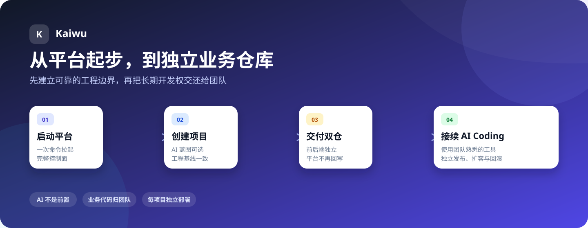
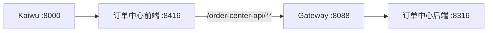

# 第一次走通 Kaiwu



> [!TIP]
> 第一次只走一条最短路径：**不开 AI、不配 Nacos、不碰 Kubernetes**。
> 先把平台跑起来，生成一个基础项目，再从工作台进入它。

走完本文，你会得到两个真正属于业务团队的独立仓库：

```text
business/
├── order-center-service/     # Java 后端 + 独立数据库 + 部署文件
└── order-center-web/         # React 前端 + 部署文件
```

生成完成后，Kaiwu 继续治理项目、成员、角色和统一入口，但不再覆盖业务源码。后续开发直接使用
团队熟悉的 IDE、AI Coding 工具和 Git 流程。

## 这次只做 5 件事

| 进度 | 你要完成什么 | 看到什么算成功 |
| --- | --- | --- |
| 01 | 启动 Kaiwu | 浏览器出现登录页 |
| 02 | 创建订单中心 | 项目进入生成流程 |
| 03 | 取走前后端仓库 | 两个仓库可以独立构建 |
| 04 | 启动业务项目 | 前后端都在本机运行 |
| 05 | 从工作台进入 | 无需再次登录，API 经过 Gateway |

---

## 01｜启动 Kaiwu

### 准备工具

只体验平台需要 Git、Docker Compose v2 和 OpenSSL。继续开发生成项目还需要：

- JDK 21、Maven 3.9+
- Node.js 20+、pnpm 10.8
- 建议至少 4 核、8 GB 可用内存
- 本机 `8000`、`8088` 端口可用

```bash
git --version
docker compose version
openssl version
```

### 一个入口启动完整平台

从 `kaiwu` 开源主页进入，入口会在被忽略的 `workspace/` 中准备四个运行仓：

```bash
git clone <kaiwu 主页仓库地址> kaiwu
cd kaiwu
./kaiwu doctor
./kaiwu up
```

第一次会下载镜像和依赖。脚本会自动生成本地密钥、执行 Flyway，并启动 MySQL、Redis、
System、Gateway 和 Web。

Release 用户会自动获得四个运行仓的同名 tag；源码开发态使用各仓默认分支。Fork 或自建 Git 服务可以在
启动前设置 `KAIWU_REPOSITORY_BASE_URL`，用 `./kaiwu repositories` 预览入口地址和版本策略。
这一阶段不会下载 `kaiwu-deploy`。

查看初始账号：

```bash
./kaiwu credentials
```

打开 [http://127.0.0.1:8000](http://127.0.0.1:8000)，使用 `admin` 和终端显示的密码登录，
然后按页面提示修改密码。

> **这一站完成了：** 你已经拥有一个可登录的 Kaiwu 控制面。

<details>
<summary>想确认所有服务确实正常？</summary>

```bash
./kaiwu status
curl --noproxy '*' http://127.0.0.1:8088/actuator/health
```

MySQL、Redis 应为 `healthy`，Gateway 应返回 `UP`。System 的 `8080` 是内部端口，
不是浏览器入口。
</details>

---

## 02｜创建订单中心

进入「项目管理」，点击「开通项目」：

| 字段 | 第一次可以这样填 |
| --- | --- |
| 项目名称 | 订单中心 |
| 项目编码 | `order-center` |
| Java 包名 | `com.example.ordercenter` |
| 说明 | 用于走通 Kaiwu 首次开发链路 |

项目编码会进入仓库名、API 前缀、镜像名和 Kubernetes Service 名，创建后不要随意修改。

### 第一次选择「基础空脚手架」

它不需要配置模型，可以最快验证 Kaiwu 的核心价值：治理边界、独立工程和后续交付。

| 方式 | 什么时候选择 |
| --- | --- |
| **基础空脚手架** | 第一次体验，或已有设计准备自己开发 |
| AI 生成项目 | 希望根据业务描述生成数据模型和第一批 CRUD |

> [!IMPORTANT]
> 一个项目只有一次初始生成。`SUCCESS` 后，平台不再重新生成或覆盖业务仓库。

<details>
<summary>AI 在这里到底做什么？</summary>

AI 不是创建项目的前置条件。选择 AI 生成时，它只负责形成受校验的业务蓝图；源码、SQL、权限、
路由、Docker 和 CI 仍由版本化模板确定性生成。

生成完成后，团队可以换回自己熟悉的 AI Coding 工具继续开发。
</details>

> **这一站完成了：** 项目工厂中的生成任务变为 `SUCCESS`。

---

## 03｜取走属于你的两个仓库

生成成功后，可以下载两个 ZIP，也可以让平台向两个空 GitLab 仓库各执行一次初始推送。

建议放成：

```text
<工作目录>/
├── kaiwu/                           # 开源统一入口
│   └── workspace/                   # 被入口仓忽略的四个运行仓
│       ├── kaiwu-system-service/
│       ├── kaiwu-gateway-service/
│       ├── kaiwu-system-web/
│       └── kaiwu-system-starter/
└── business/
    ├── order-center-service/        # 业务后端仓
    └── order-center-web/            # 业务前端仓
```

快速检查交付内容：

```bash
test -f <工作目录>/business/order-center-service/pom.xml
test -f <工作目录>/business/order-center-service/deploy/server/compose.yml
test -f <工作目录>/business/order-center-service/deploy/k8s/kustomization.yaml

test -f <工作目录>/business/order-center-web/package.json
test -f <工作目录>/business/order-center-web/deploy/server/nginx-locations.conf
test -f <工作目录>/business/order-center-web/deploy/k8s/ingress.yaml
```

> **这一站完成了：** 前后端都有自己的源码、构建、CI 和部署材料，不依赖 Kaiwu 才能继续开发。

---

## 04｜在本机运行业务项目

本地联调时，MySQL 和 Redis 留在 Docker；平台应用切换为本机进程，这样 Gateway 才能访问
业务后端的 `127.0.0.1`。

### 先切换平台开发模式

```bash
cd <工作目录>/kaiwu

mkdir -p workspace/kaiwu-gateway-service/routes.local.d
cp ../business/order-center-service/docs/gateway-route-local.yml \
  workspace/kaiwu-gateway-service/routes.local.d/order-center.yml

./kaiwu down
export KAIWU_LOCAL_PROJECT_WEB_PROXY='order-center=http://127.0.0.1:8416'
./kaiwu dev
```

这两项配置建立了明确路径：



### 启动业务后端

打开一个新终端：

```bash
cd <工作目录>/business/order-center-service

export JAVA_HOME=/opt/homebrew/opt/openjdk@21/libexec/openjdk.jdk/Contents/Home
export MAVEN_SKIP_RC=1
export DB_PASSWORD='<本地业务库密码>'
export KAIWU_LOCAL_DB_ROOT_PASSWORD='<本地业务库 root 密码>'
export KAIWU_CONTEXT_PUBLIC_KEY="$(cd <工作目录>/kaiwu && ./kaiwu context-public-key)"

bash scripts/dev.sh --verify
```

验证：

```bash
curl http://127.0.0.1:8316/actuator/health
```

返回 `UP` 即可。直连业务 API 得到 401 是正确结果：真实业务请求必须经过 Gateway。

### 启动业务前端

再打开一个终端：

```bash
cd <工作目录>/business/order-center-web
bash scripts/dev.sh
```

> **这一站完成了：** 平台、Gateway、业务前端和业务后端都在运行，业务数据库与平台数据库独立。

<details>
<summary>为什么需要同源前端入口？</summary>

主站通过 `/apps/order-center/` 打开业务前端时，双方同源，平台才能使用随机 nonce 约束的
消息协议派发内存 Access Token。Token 不进入 URL、Cookie、localStorage 或 sessionStorage。

直接打开 `http://127.0.0.1:8416` 属于跨源独立开发模式，平台不会向它传 Token。
</details>

---

## 05｜从 Kaiwu 工作台进入项目

回到「项目管理 → 编辑项目」，设置：

| 配置 | 本地值 |
| --- | --- |
| 业务后台入口 | `http://127.0.0.1:8000/apps/order-center/` |
| 服务地址 | 本地联调可以暂不填写 |

保存后回到工作台点击「进入」。

平台会自动追加项目 ID，在新窗口打开订单中心，并把内存 Token 安全交给业务前端。浏览器中的
业务请求应该访问 `/order-center-api/**`，而不是直连 `8316`。

### 最后的验收清单

- [ ] 从工作台进入订单中心时不需要再次登录
- [ ] 业务请求经过 `/order-center-api/**`
- [ ] 非项目成员访问得到 403
- [ ] 有权限的项目成员可以进入
- [ ] 后端 `mvn verify` 通过
- [ ] 前端 `pnpm verify` 通过

基础空脚手架还没有业务菜单，可以先跳过菜单验证。

<details>
<summary>AI 生成项目或后续新增模块，怎样处理菜单？</summary>

AI 初始生成的菜单已由项目工厂登记。后续在业务仓新增模块并更新 `sql/menu.sql` 后，可以执行：

```bash
cd <工作目录>/kaiwu
./kaiwu import-project-menu ../business/order-center-service/sql/menu.sql
```

然后在「项目管理 → 角色与菜单」中分配权限。`menu.sql` 属于平台库，不能导入业务数据库。
</details>

---

## 接下来，代码怎么继续生长

从现在开始，日常工作发生在两个业务仓库，而不是回平台寻找“再次生成”：


每个生成仓都带着自己的 `AGENTS.md`、`CLAUDE.md`、工程约束、权限检查、Dockerfile 和 CI。
它们能让新的开发者或 AI 工具快速获得一致起点，也能降低多项目长期开发中的风格漂移。

Kaiwu 不替代业务设计、测试和评审；它负责把这些工作放进一个边界清晰、可验证、可交付的工程里。

## 准备上线？选择一条路线

| 部署环境 | 适合什么情况 | 从这里继续 |
| --- | --- | --- |
| 一台传统服务器 | 体验、内网系统、中小规模单机部署 | [传统服务器部署](SERVER-DEPLOYMENT.md) |
| Kubernetes | 已有集群、GitOps、弹性和高可用要求 | [Kubernetes 部署](KUBERNETES.md) |
| 多台 VM + 动态实例 | 没有编排器，才考虑注册中心 | [Nacos 可选配置](NACOS.md) |

> [!NOTE]
> 本机、单机 Compose 和 Kubernetes 默认都不需要 Nacos。Gateway 始终只接受逐条显式业务路由，
> 不会把注册表里的所有服务自动暴露出去。

选择 Kubernetes 时再获取可选部署仓，不会增加第一次体验的下载和认知成本：

```bash
cd <工作目录>/kaiwu
./kaiwu deploy-init
```

## 卡住时先看这里

| 现象 | 先检查什么 |
| --- | --- |
| 平台起不来 | `./kaiwu logs` |
| `8000` 或 `8088` 被占用 | 停止旧进程，不要把 System `8080` 当浏览器入口 |
| 业务后端缺 Context 公钥 | 重新执行 `kaiwu.sh context-public-key` 并重启后端 |
| 业务健康但 API 返回 401 | 请求是否绕过 Gateway 直连了业务端口 |
| 业务 API 返回 404 | Route 文件位置、路径前缀和 Gateway 状态 |
| 业务 API 返回 403 | 用户是否为 ACTIVE 项目成员，角色是否有权限 |
| 从主站进入后仍未登录 | 入口是否同源，是否绕过主站直接打开 dev server |

停止环境但保留数据：

```bash
./kaiwu down
./kaiwu local-down  # 仅在本机进程模式下需要
```

删除本地平台数据需要二次确认：

```bash
./kaiwu reset
```

## 想进一步理解 Kaiwu

- [架构图谱：Kaiwu 是什么，为什么更适合后续 AI Coding](ARCHITECTURE-GUIDE.md)
- [项目工厂：AI 可选、一次生成和独立交付](PROJECT_FACTORY.md)
- [项目访问：Gateway、项目路由与 Token 边界](PROJECT_ACCESS.md)
- [使用 AI Agent 继续开发](AGENT_DEVELOPMENT.md)
- [安全策略](../SECURITY.md)
