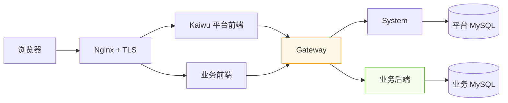

# 传统服务器部署：用 Docker Compose 上线 Kaiwu 与业务项目

这条路线适合体验、内网系统或中小规模单机部署。它保留 Kaiwu 的关键边界：平台与业务项目
分别部署，业务数据库独立，外部请求统一经过 Gateway。

> [!WARNING]
> 这是单机起步方案，不是高可用生产架构。正式生产还需要 TLS、备份、监控、资源限制、
> 镜像仓库和恢复演练。



## 1. 部署 Kaiwu 平台

服务器上保持四个 Kaiwu 仓库同级：

```text
<服务器>/kaiwu/
├── kaiwu-system-starter/
├── kaiwu-system-service/
├── kaiwu-gateway-service/
└── kaiwu-system-web/
```

进入 `kaiwu-system-service`，在仓库外创建长期运行密钥：

```bash
cd <服务器>/kaiwu/kaiwu-system-service
mkdir -p ../.kaiwu-server
./scripts/kaiwu-server-env.sh ../.kaiwu-server/runtime.env

docker compose --env-file ../.kaiwu-server/runtime.env \
  -f docker-compose.yml \
  -f docker-compose.server.yml \
  up -d --build --wait
```

后续使用 `kaiwu.sh` 控制服务器环境时，始终指定同一个文件：

```bash
export KAIWU_RUNTIME_ENV_FILE="$PWD/../.kaiwu-server/runtime.env"
```

`runtime.env` 权限为 `0600`，升级必须复用，不能提交 Git。轮换 AES 或 RSA 密钥会让已有密文、
会话或业务 Context 失效。首次登录后立即修改管理员密码。

平台 Nginx 示例位于：

```text
deploy/server/nginx/kaiwu.conf.example
```

### 用已有的 MySQL / Redis

默认会一并起内置的 MySQL 与 Redis。要接自己已经在运行的实例，加一个覆盖文件，
并用环境变量给出地址：

```bash
export KAIWU_DB_HOST=mysql.internal
export KAIWU_DB_PORT=3306
export KAIWU_DB_NAME=kaiwu_platform
export KAIWU_DB_USER=kaiwu
export KAIWU_MYSQL_PASSWORD='<该账号的密码>'

export KAIWU_REDIS_HOST=redis.internal
export KAIWU_REDIS_PORT=6379
export KAIWU_REDIS_PASSWORD='<Redis 密码>'

docker compose --env-file ../.kaiwu-server/runtime.env \
  -f docker-compose.yml \
  -f docker-compose.server.yml \
  -f docker-compose.external-db.yml \
  -f docker-compose.external-redis.yml \
  up -d --build --wait
```

两个覆盖文件各管一个，可以只用其中一个——只换数据库、Redis 仍用内置的，
是常见组合。不带这些文件时行为不变。

用 `./kaiwu up` 或 `scripts/kaiwu.sh` 启动时不必手工写 `-f`：只要设了
`KAIWU_DB_HOST` 或 `KAIWU_REDIS_HOST`，对应的覆盖文件会被自动叠加。

两点必须先确认：

- **库与账号要预先建好**，账号至少对该库有建表权限；
- **目标库应为空库**。首次启动会由 Flyway 从 V1 迁移到最新版本，等于在该库上
  完整建表；库里已有更高版本的迁移记录时，`schema-compat-check` 会拒绝启动。

密码来自 `runtime.env` 中的 `KAIWU_MYSQL_PASSWORD` / `KAIWU_REDIS_PASSWORD`；
上面用 shell 变量覆盖它们即可，**shell 环境优先级高于 `--env-file`**。
地址或口令写错时，`schema-compat-check` 会打印数据库返回的原始错误后退出。

### 用 Nacos 管理配置

不想把配置项堆在 `runtime.env` 里时，可以让服务器环境也从 Nacos 读运行配置：

```bash
export KAIWU_SPRING_PROFILE=prod          # 读 kaiwu-*-prod.yml 两个 Data ID
export KAIWU_NACOS_SERVER_ADDR='nacos.internal:8848'
export KAIWU_NACOS_NAMESPACE='<命名空间 ID>'
export KAIWU_NACOS_USERNAME='<账号>'
export KAIWU_NACOS_PASSWORD='<口令>'

docker compose --env-file ../.kaiwu-server/runtime.env \
  -f docker-compose.yml \
  -f docker-compose.server.yml \
  -f docker-compose.nacos.yml \
  up -d --build --wait
```

四个覆盖文件互相独立，可任意组合：`server` 是服务器形态，`external-db` 与
`external-redis` 分别接自己的数据库与缓存，`nacos` 是从 Nacos 读配置。

RSA 私钥与各类口令仍来自 `runtime.env`，不进 Nacos。完整说明与常见错误见
[NACOS.md](NACOS.md)。

## 2. 部署业务后端

以下继续使用快速开始中的 `order-center` 示例：

```bash
cd <服务器>/business/order-center-service

export DB_PASSWORD='<业务库密码>'
export DB_ROOT_PASSWORD='<业务库 root 密码>'
export KAIWU_CONTEXT_PUBLIC_KEY="$(cd <服务器>/kaiwu/kaiwu-system-service && \
  KAIWU_RUNTIME_ENV_FILE=<服务器>/kaiwu/.kaiwu-server/runtime.env \
  ./scripts/kaiwu.sh context-public-key)"

docker compose -f deploy/server/compose.yml up -d --build --wait
```

业务 Compose 会创建独立 MySQL volume，并加入平台 Compose 网络。平台 Compose 项目名不是
`kaiwu` 时，通过 `KAIWU_PLATFORM_NETWORK` 指定实际网络名。

把业务仓自带的显式路由交给 Gateway：

```bash
cp deploy/server/gateway-route.yml \
  <服务器>/kaiwu/kaiwu-system-service/routes.managed.d/order-center.yml

cd <服务器>/kaiwu/kaiwu-system-service
KAIWU_RUNTIME_ENV_FILE=<服务器>/kaiwu/.kaiwu-server/runtime.env \
  ./scripts/kaiwu.sh reload-routes
```

> [!IMPORTANT]
> 受管路由存在空文件、错误 URI、重复 ID 或缺少 `PROJECT` 元数据时，Gateway 会拒绝启动，
> 不会带着不完整的权限边界上线。

## 3. 部署业务前端

```bash
cd <服务器>/business/order-center-web
docker compose -f deploy/server/compose.yml up -d --build
```

把生成仓中的下面文件合并到 Kaiwu 域名对应的 Nginx `server {}` 中：

```text
deploy/server/nginx-locations.conf
```

然后在 Kaiwu「项目管理」中设置：

| 配置 | 服务器值 |
| --- | --- |
| 业务后台入口 | `https://<域名>/apps/order-center/` |
| 服务地址 | `http://kaiwu-order-center-service:8080` |

同一域名下，平台可以通过 nonce 消息桥接把内存 Token 派发给业务前端；浏览器业务请求始终进入
`/order-center-api/**`，再由 Gateway 转发到业务后端。

## 4. 上线验收

- [ ] 平台域名使用 HTTPS
- [ ] 能从平台工作台进入订单中心，无需再次登录
- [ ] 浏览器 API 只访问 `/order-center-api/**`
- [ ] 非项目成员访问得到 403
- [ ] 业务后端端口没有直接暴露公网
- [ ] 平台数据库与订单中心数据库独立
- [ ] 重启服务器后平台和业务容器自动恢复
- [ ] 数据库备份和恢复流程已经实际演练

## 5. 常见问题

| 现象 | 先检查什么 |
| --- | --- |
| Gateway 重启失败 | `routes.managed.d/` 中是否有空 YAML、重复 ID、错误 URI 或缺失元数据 |
| 业务 API 返回 404 | Nginx 路径、Gateway Route 前缀和项目编码是否一致 |
| 业务 API 返回 401 | 是否绕过 Gateway 直连业务后端，Context 公钥是否配对 |
| 业务 API 返回 403 | 用户是否为 ACTIVE 项目成员，角色是否有对应菜单权限 |
| 修改密码后数据库仍拒绝连接 | 已有 volume 不会自动修改 MySQL 账号密码 |
| 业务容器找不到平台网络 | 用 `docker network ls` 确认名称，并设置 `KAIWU_PLATFORM_NETWORK` |

查看平台日志：

```bash
cd <服务器>/kaiwu/kaiwu-system-service
KAIWU_RUNTIME_ENV_FILE=<服务器>/kaiwu/.kaiwu-server/runtime.env \
  ./scripts/kaiwu.sh logs
```

返回首次使用主线：[第一次走通 Kaiwu](QUICKSTART.md)。
